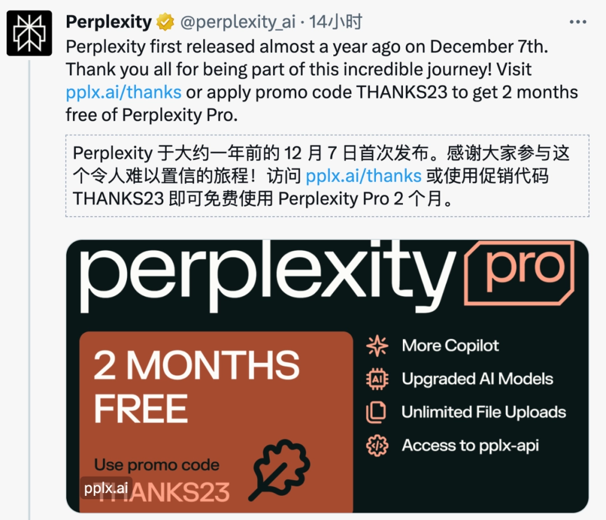
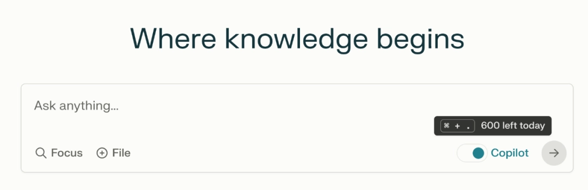
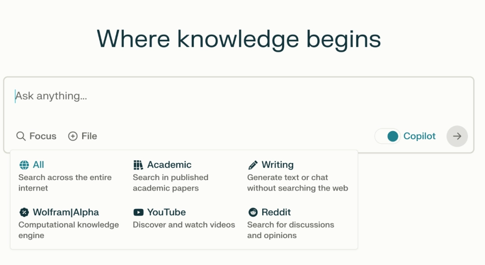
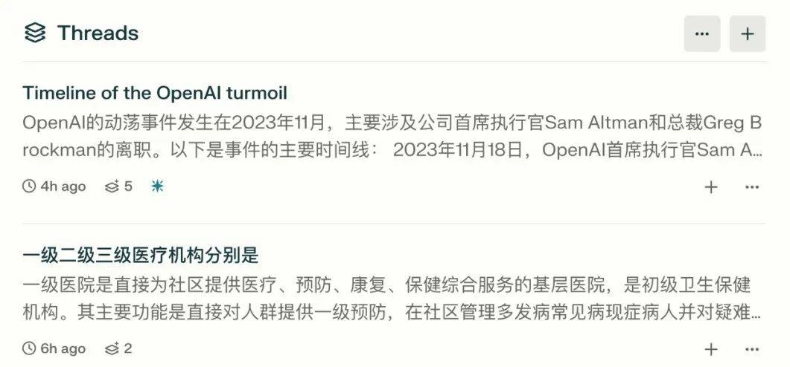
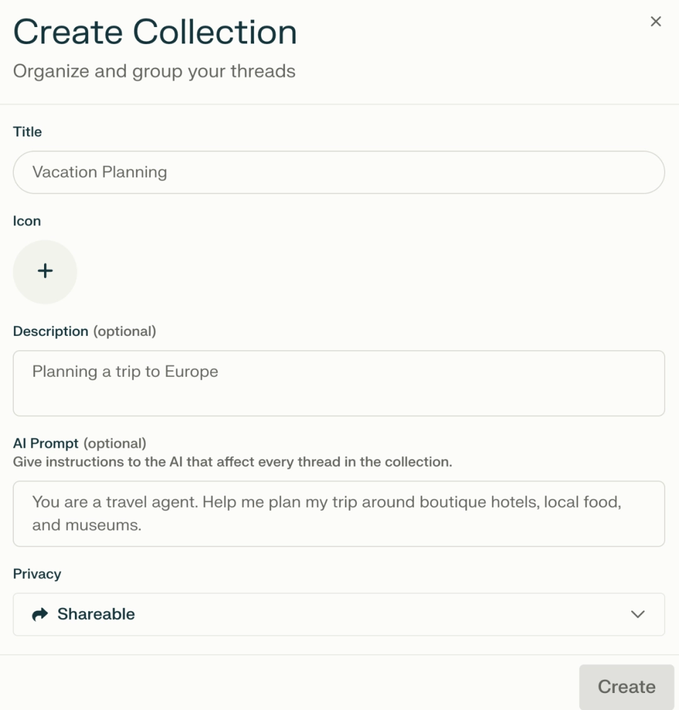
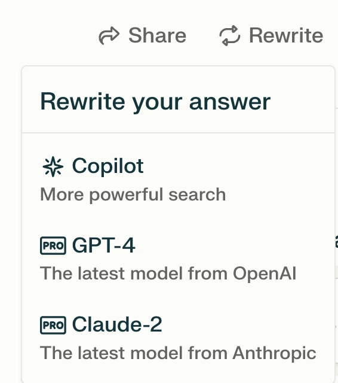
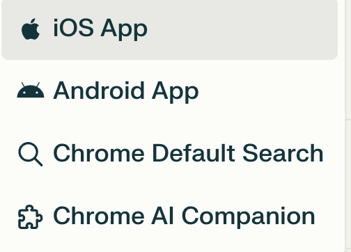
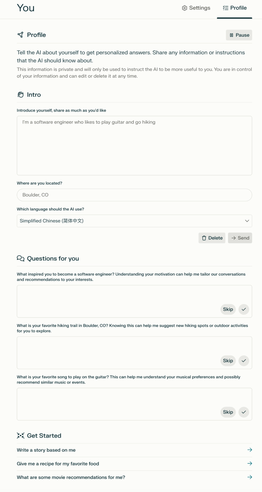
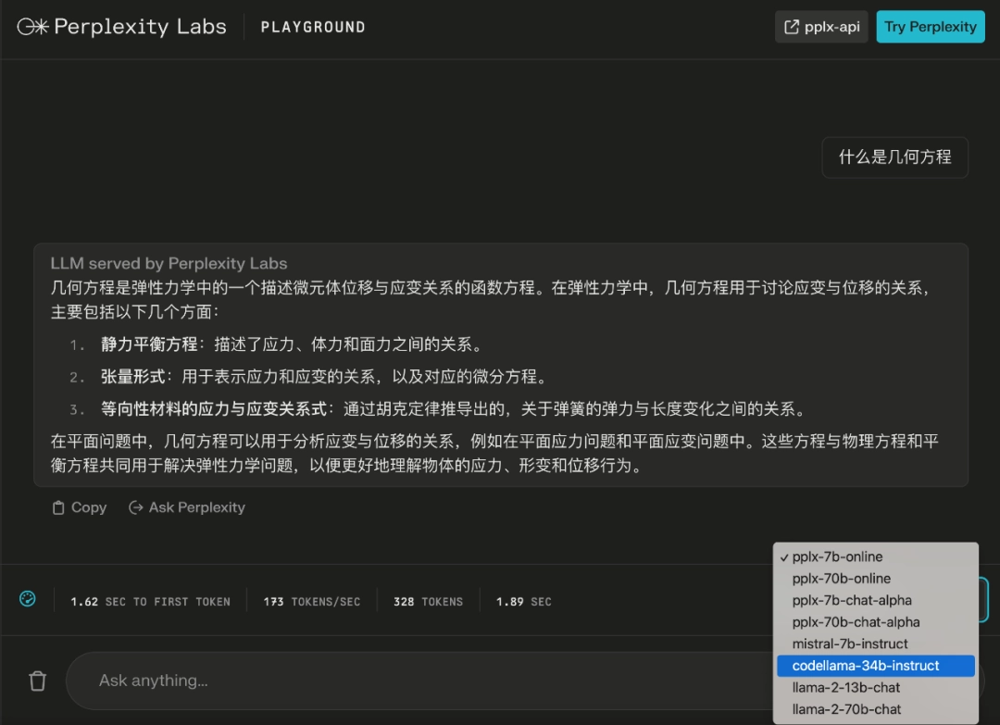
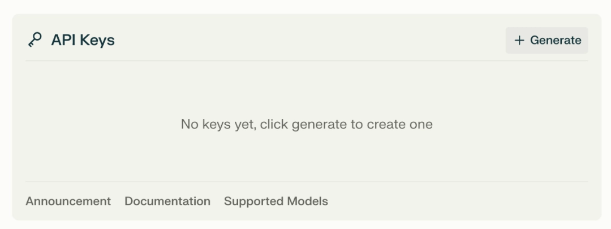

# 免费用两个月Perplexity Pro，GPT-4和Claude-2随便切换

---

如果你经常需要查资料、做研究，或者只是想找个靠谱的AI助手聊天，现在有个好消息：Perplexity Pro开放了两个月免费试用。这不是那种"免费但只能问三个问题"的套路——你每天至少能用600次，而且GPT-4和Claude-2都能用。

这篇文章会告诉你Perplexity Pro到底能干什么，怎么用最划算，以及为什么它可能比你现在用的工具更适合你。

---

## 先说说能用多少次

Perplexity Pro的使用次数是这样的：

- Perplexity自家模型：每天至少300次
- GPT-4或Claude-2：每天至少300次
- 加起来一天至少600次

而且这里的GPT-4是32k版本，Claude-2是100k版本。什么意思？就是你可以一次性喂给它更长的文本，比如一整篇论文或者一份合同。

## Copilot功能：会问问题的搜索助手

Perplexity有个叫Copilot的功能，它的特别之处在于：

- **会反问你**：你问个模糊的问题，它不会直接给你一堆无关答案，而是先问清楚你到底想要什么
- **帮你总结**：从一堆来源里提炼出关键信息，不用你自己翻几十页搜索结果
- **来源多样**：学术论文、新闻、论坛都能搜，不只是网页

举个例子，你问"最近有什么好用的AI工具"，它可能会反问："你是想要写作类的、编程类的，还是图像处理类的？"这样一来，你得到的答案就精准多了。

### 适合什么场景

- **学术研究**：帮你做文献综述，列出相关论文并总结要点
- **专业工作**：律师查案例、营销人员看趋势、程序员调试代码
- **看新闻**：从多个角度整合信息，不会只给你一家之言

## 几个实用的小功能

### Focus：缩小搜索范围

开始新对话时，点击"Focus"按钮，可以选择只搜索特定类型的来源。比如你只想看学术论文，或者只想看Reddit上的讨论，都可以直接筛选。

### Thread：完整的对话记录

每个Thread就是一次完整的对话，包括你的问题、追问和AI的回答。这样你可以随时回头看之前聊了什么，不用担心丢失上下文。

### Collections：分类管理

可以把不同主题的对话整理到不同的Collection里，方便分享或者协作。比如你在做一个项目，可以把所有相关的搜索和对话都放在一个Collection里。

## 三个模型怎么选

Perplexity Pro提供三个模型：

- **GPT-4-32k**：适合分析和编程，逻辑性强
- **Claude-2-100k**：适合写作和总结，语言更自然
- **Perplexity自家模型**：速度快，适合快速查询

我的建议是：写东西用Claude-2，写代码或者分析数据用GPT-4，👉 [快速查个信息就用Perplexity自己的模型](https://pplx.ai/ixkwood69619635)。

## 可以上传文件

这个功能挺实用的：

- 支持纯文本、代码和PDF
- 单个文件最大25MB，一次最多4个
- 免费用户每天3个，Pro用户每天100个
- 文件内容保留30天

比如你有一份PDF报告，可以直接上传，然后问"这份报告的核心结论是什么"，它会帮你提炼出来。

## 个性化设置

可以在设置里填写你的职业、兴趣等信息，AI会根据这些来定制回答。比如你是程序员，它给你的答案会更偏技术向；你是营销人员，它会更关注商业角度。

## 多平台支持

Perplexity支持：

- 网页端
- 安卓和iOS App
- 两个Chrome插件

这意味着你可以在电脑上查资料，在手机上继续看，或者直接在浏览器里用插件快速搜索。

## Pro用户还能用API

Perplexity在10月推出了pplx-api，Pro用户可以免费使用。支持的模型包括：

- Mistral 7B
- Llama2 13B
- Code Llama 34B
- Llama2 70B
- replit-code-v1.5-3b

API的优势是速度快，比Replicate低2.9倍延迟，比Anyscale低3.1倍。如果你是开发者，这个功能值得试试。

---

## 总结一下

Perplexity Pro现在免费两个月，每天至少600次使用机会，支持GPT-4和Claude-2。它的Copilot功能会帮你理清思路，Focus和Collections让搜索更高效，还能上传文件直接分析。

如果你经常需要查资料、做研究，或者只是想要一个更聪明的搜索工具，👉 [现在是试试Perplexity的好时机](https://pplx.ai/ixkwood69619635)。毕竟免费两个月，不用白不用。
